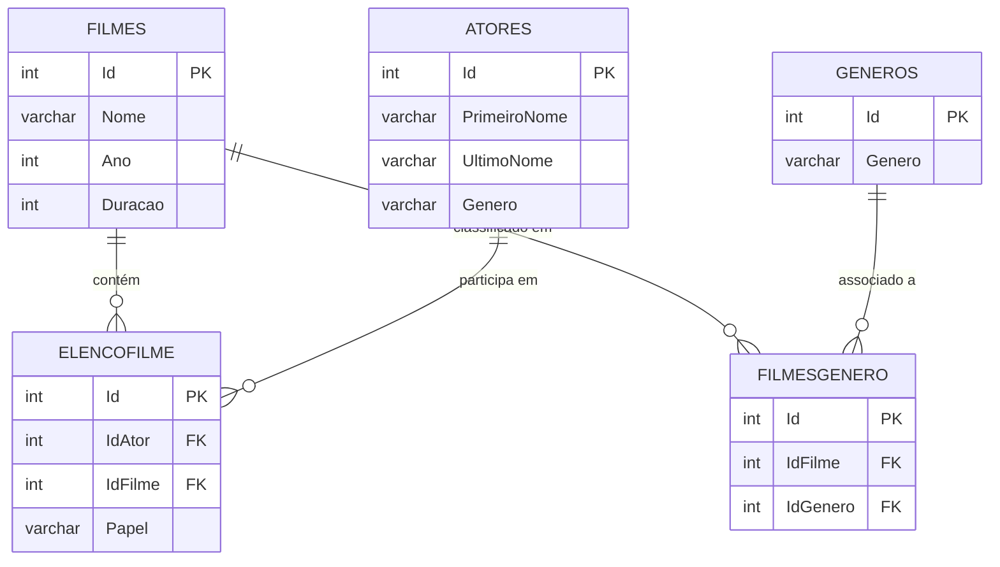

# Documentação de Consultas SQL e Diagrama do Banco de Dados

## Descrição do Projeto

Este projeto conta com um banco de dados SQL Server composto por cinco tabelas que armazenam informações de filmes, atores e gêneros, além de tabelas de relacionamento para representar os vínculos muitos-para-muitos entre filmes e atores (*ElencoFilme*) e entre filmes e gêneros (*FilmesGenero*).  
Esta documentação descreve as consultas SQL desenvolvidas para extrair dados relevantes e apresenta um diagrama MERMAID com a estrutura e os relacionamentos do banco.

## Estrutura das Tabelas

- **Filmes**  
  Armazena informações sobre os filmes, como nome, ano de lançamento e duração.

- **Atores**  
  Armazena dados sobre os atores, incluindo o primeiro nome, último nome e o gênero.

- **Generos**  
  Tabela dedicada a armazenar os gêneros dos filmes.

- **ElencoFilme**  
  Representa o relacionamento muitos-para-muitos entre filmes e atores, registrando também o papel desempenhado em cada filme.

- **FilmesGenero**  
  Representa o relacionamento muitos-para-muitos entre filmes e gêneros, permitindo que um filme possua múltiplos gêneros e vice-versa.

## Diagrama MERMAID do Banco de Dados


## Consultas SQL

A seguir, são apresentadas as consultas implementadas:

### 1. Buscar o nome e ano dos filmes
   ```sql
   SELECT Nome, Ano
   FROM Filmes;
   ```
### 2. Buscar o nome e ano dos filmes, ordenados por ordem crescente pelo ano
```sql
SELECT Nome, Ano
FROM Filmes
ORDER BY Ano ASC;
```
### 3. Buscar pelo filme "De Volta para o Futuro", trazendo o nome, ano e a duração
```sql
SELECT Nome, Ano, Duracao
FROM Filmes
WHERE Nome = 'De Volta para o Futuro';
```
### 4. Buscar os filmes lançados em 1997
```sql
SELECT Nome, Ano
FROM Filmes
WHERE Ano = 1997;
```

### 5. Buscar os filmes lançados após o ano 2000
```sql
SELECT Nome, Ano
FROM Filmes
WHERE Ano > 2000;
```

### 6. Buscar os filmes com a duração maior que 100 e menor que 150, ordenando pela duração em ordem crescente
```sql
SELECT Nome, Duracao
FROM Filmes
WHERE Duracao > 100 AND Duracao < 150
ORDER BY Duracao ASC;
```
### 7. Buscar a quantidade de filmes lançados n- o ano, agrupando por ano, ordenando pela quantidade em ordem decrescente
*(Observação: foi utilizado o count dos filmes para a ordenação, visto que “duração” não se aplica nesse contexto.)*
```sql
SELECT Ano, COUNT(*) AS Quantidade
FROM Filmes
GROUP BY Ano
ORDER BY Quantidade DESC;
```
### 8. Buscar os Atores do gênero masculino, retornando o PrimeiroNome e o UltimoNome
```sql
SELECT PrimeiroNome, UltimoNome
FROM Atores
WHERE Genero = 'M';
```
### 9. Buscar os Atores do gênero feminino, retornando o PrimeiroNome e o UltimoNome, ordenando pelo UltimoNome
```sql
SELECT PrimeiroNome, UltimoNome
FROM Atores
WHERE Genero = 'F'
ORDER BY UltimoNome;
```
### 10. Buscar o nome do filme e o gênero
*(Nesta consulta, é realizada a junção entre as tabelas Filmes, FilmesGenero e Generos.)*
```sql
SELECT f.Nome, g.Genero
FROM Filmes f
JOIN FilmesGenero fg ON f.Id = fg.IdFilme
JOIN Generos g ON fg.IdGenero = g.Id;
```
### 11. Buscar o nome do filme e o gênero do tipo "Mistério"
SELECT f.Nome, g.Genero
FROM Filmes f
JOIN FilmesGenero fg ON f.Id = fg.IdFilme
JOIN Generos g ON fg.IdGenero = g.Id
WHERE g.Genero = 'Mistério';


### 12. Buscar o nome do filme e os atores, trazendo o PrimeiroNome, UltimoNome e seu Papel
*(A junção é feita entre as tabelas Filmes, ElencoFilme e Atores.)*
```sql
SELECT f.Nome, a.PrimeiroNome, a.UltimoNome, ef.Papel
FROM Filmes f
JOIN ElencoFilme ef ON f.Id = ef.IdFilme
JOIN Atores a ON ef.IdAtor = a.Id;
```

## Considerações Finais
Este documento apresenta as principais consultas para extrair dados do banco e o diagrama MERMAID que ilustra a estrutura e os relacionamentos entre as tabelas. Essas informações auxiliam no entendimento e na manutenção da base de dados, facilitando futuras implementações e análises.

